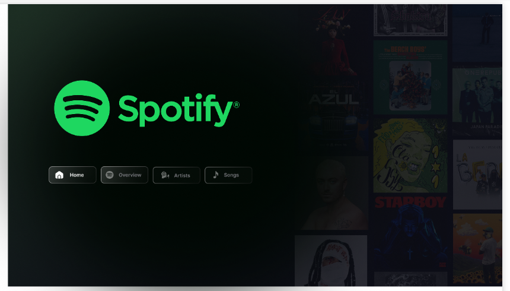
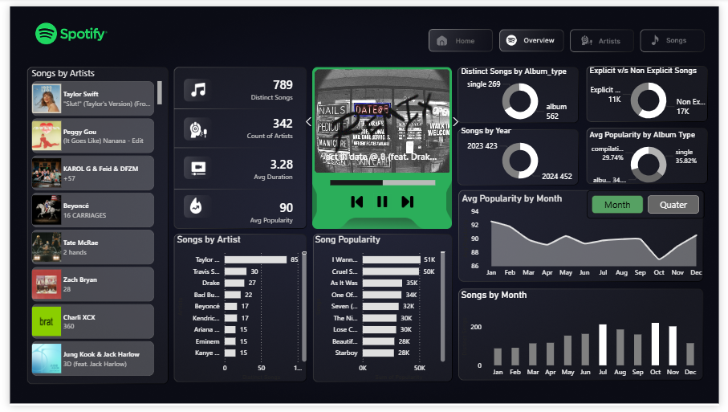
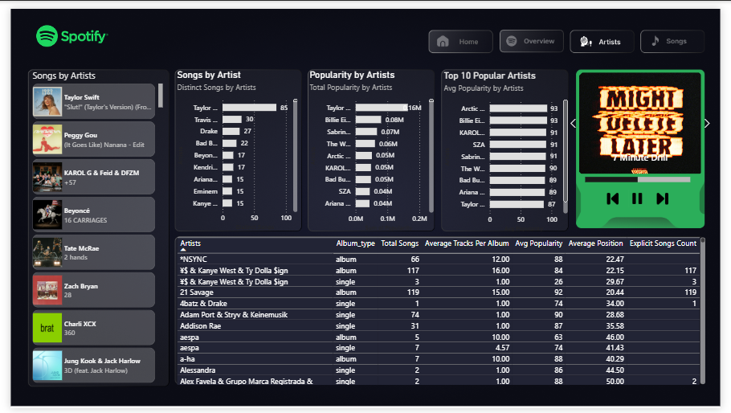
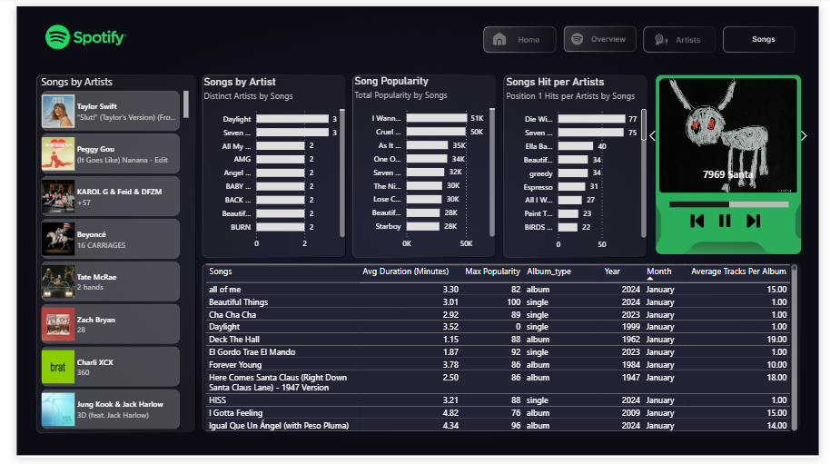

# 🎧 Spotify Global Trends Dashboard -- Power BI Project

## 📌 Project Overview

This project is an interactive **Spotify Global Trends Dashboard** built
using Power BI.

The dashboard analyzes global music trends, artist dominance, song
popularity, album types, and ranking performance using real-world
Spotify dataset insights.

The goal of this project is to transform raw music data into meaningful
business insights using data modeling, DAX, and visualization
techniques.

------------------------------------------------------------------------

## 📊 Dashboard Structure

The report contains **4 interactive pages**:

------------------------------------------------------------------------

## 🏠 Home Page

-   Spotify-inspired landing page\
-   Navigation buttons for smooth page switching\
-   Clean dark-themed UI design

### 🔎 Preview:

------------------------------------------------------------------------

## 📈 Overview Page

### 🔢 KPI Cards:

-   🎵 **789** Distinct Songs\
-   🎤 **342** Artists\
-   ⏱ **3.28 Minutes** Average Duration\
-   ⭐ **90** Average Popularity

### 📊 Visuals:

-   Songs by Year (2023 vs 2024 comparison)\
-   Distinct Songs by Album Type (Single vs Album)\
-   Explicit vs Non-Explicit Songs\
-   Average Popularity by Month (Trend Analysis)\
-   Top Songs by Total Popularity

### 🔎 Preview:

------------------------------------------------------------------------

## 🎤 Artists Page

-   Songs by Artist (Top contributors)\
-   Total Popularity by Artist\
-   Top 10 Artists by Average Popularity\
-   Album Type comparison per artist\
-   Average Position & Explicit Song metrics

### 🔎 Preview:

------------------------------------------------------------------------

## 🎵 Songs Page

-   Song Popularity (Total Popularity by Song)\
-   Position #1 Hits per Artist\
-   Duration vs Popularity Analysis\
-   Album Type & Release Year Breakdown\
-   Detailed Song Performance Table

### 🔎 Preview:

------------------------------------------------------------------------

## 🛠 Tools & Technologies Used

-   **Power BI**\
-   **DAX (Data Analysis Expressions)**\
-   Data Modeling\
-   Data Cleaning & Transformation\
-   Interactive Visualizations\
-   Dashboard UI/UX Design

------------------------------------------------------------------------

## 📂 Project Folder Structure

spotify-analytics-power-bi-dashboard/
│
├── Dataset/        → Spotify dataset used for analysis
├── Dashboard/      → Power BI dashboard file (.pbix)
├── Screenshots/    → Dashboard preview images
└── README.md       → Project documentation

------------------------------------------------------------------------

## 🔍 Key Insights

-   Certain artists consistently dominate both song count and popularity
    rankings.\
-   Singles tend to perform strongly compared to full albums.\
-   Explicit content forms a significant share of top-ranking songs.\
-   Monthly popularity trends show noticeable fluctuations across the
    year.\
-   Top-performing artists maintain average popularity scores above 90.

------------------------------------------------------------------------

## 📚 Skills Demonstrated

-   Data Cleaning & Preparation\
-   Exploratory Data Analysis (EDA)\
-   Advanced DAX Measure Creation\
-   KPI Development\
-   Trend Analysis\
-   Insight Storytelling\
-   Professional Dashboard Design

------------------------------------------------------------------------

## 🚀 Future Improvements

-   Integrate Spotify API for real-time data\
-   Add streaming count & listener metrics\
-   Implement predictive popularity modeling\
-   Enhance drill-through and dynamic filtering

------------------------------------------------------------------------

## 👩‍💻 Author

**Bhawana**

Aspiring Data Analyst \| Excel • SQL • Power BI

📧 Email: bhawna.160204@gmail.com\
🔗 LinkedIn: https://www.linkedin.com/in/bhawana-12677b382/\
💻 GitHub: https://github.com/Bhawana1602
